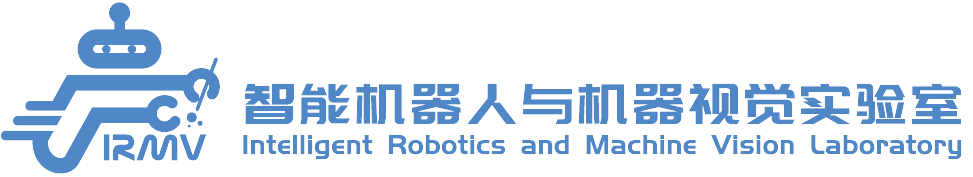

# template


## Table of Contents

- [Description](#description)
- [Dependencies](#dependencies)
- [Build](#build)
- [Installation](#installation)
- [Usage](#usage)

## Description

Template is a template repository for C++ projects. It provides a basic structure for C++ projects, including a CMake
build system, a basic directory structure.

## Dependencies

### Basic Environment

- `cmake >= 3.21`

### Binary Packages

The following binary packages are required: `eigen3`.

These binary packages can be installed via:

```shell
sudo apt-get install libeigen3-dev
```

### IRMV Packages

The following custom packages are required: `imc`.

These packages need to be obtained from the IRMV Lab.

## Build

```shell
cmake -B build . -DCMAKE_BUILD_TYPE=Release
cmake --build build
```

## Installation

You can install the provided package directly:

```shell
cd build && sudo make install
```

or you can create a Debian package and install it for convenient deployment:

```shell
cd build && cpack
sudo dpkg -i template-xxxx.deb
```

## Usage
we need to install irmv_core, and some setting:
```bash
sudo ln -s /usr/local/include/irmv/third_party/plog /usr/local/include/plog
```
### C++ Usage

c++ usage example can be found at `test/test_example.cpp`

One can compile own code via:

```cmake
find_package(template REQUIRED)
add_executable(example example.cpp)
target_link_libraries(example template_interface)
```

### Python Usage

We provide a Python interface for the trajectory generator. Users should first install the Python package (Pybind11 are required):

One can get the Pybind11 package via:

```shell
git submodule update --init --recursive
```

Then, users can install the Python package via 

**Notice that python install must be done after the build and install process, 
and the term "template" below should be replaced with your own project name**

```shell
cd build && cmake .. -DCMAKE_BUILD_TYPE=Release -DCOMPILE_template_PYBINDING=ON
make -j$(nproc) && sudo make install
```

```shell
pip install .
```
Then, users can use the Python interface according to `example/example.py`

## Citation

If you use this code in your research, please cite the us as follows:

```bibtex
@misc{ZHOU2024template
    title={{TEMPLATE: IRMV CMAKE Template}}, 
    author={Zhou, Yixuan, and Wang, Hesheng}, 
    year={2024},
    url={https://github.com/IRMV-Manipulation-Group/TEMPLATE}
}
```